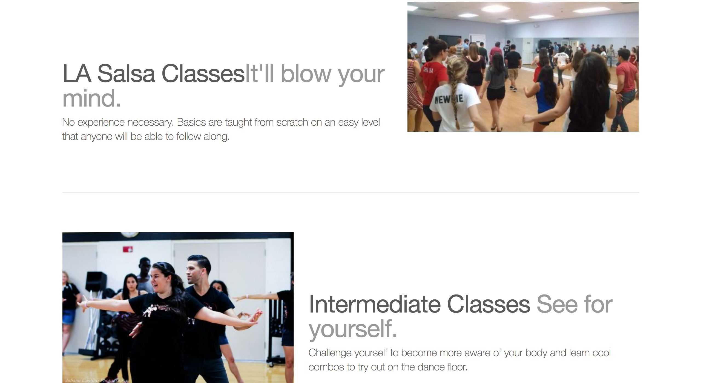

<div align="center">
  

  <p>
    <a href="#monorepository-portfolio"><strong> Monorepository</strong></a> ·
    <a href="#about-lucas"><strong>About Lucas</strong></a> ·
    <a href="#projects-showcase"><strong>Projects Showcase</strong></a> ·
    <a href="#contact-info"><strong>Contact Info</strong></a>
  </p>

  <p>
    <a href="mailto:lucas.gomes.costa@gmail.com"><strong> Email Me </strong></a> ·
    <a href="https://www.linkedin.com/in/lucas-gomes-costa/"><strong> LinkedIn </strong></a> ·
    <a href="https://lgc13.wordpress.com/"><strong>WordPress </strong></a>
  </p>

</div>

<hr>

### Monorepository Portfolio

Thanks for checking out my Github account! As of August 2018, I decided to revamp my entire portfolio onto a single centralized GitHub Monorepository! This allows me to:

1. Easily showcase (and remove from showcase) any of my projects, including their summaries, concepts, code snippets, code explanation, and screenshots.
2. Organize projects by subdividing their directories by the main technology/language used so that I can easily find it at a later time.

The goal is to make browsing through my project/directories fairly intuitive. Here's the layout that I created for this repo:

```sh

LucasCosta_portfolio
├── android_studio
│   └── project#
│   └── practice
├── c#
│   └── project#
│   └── practice
├── c++
│   └── project#
│   └── practice
├── java
│   └── project#
│   └── practice
├── python
│   └── project#
│   └── practice
└── web_dev
    └── project#
    └── practice

```

Each folder holds the biggest projects that I've done with that specific technology right inside its directory. There is also a 'practice' folder which has all other project/example exercises that I've done with said language.

---

### About Lucas

<div align="center">
  <h3>
    
    Brazilian Born
    
    American Raised
    
    Danish at Heart
  </h3>
</div>

I am enthusiastic, adaptive, responsible and hardworking. I strive at using my life and work experiences to plan ahead for any possible future challenges, as well as properly handling any current ongoing problems that I encounter. I enjoy investing time in learning and research, as new breakthroughs do not happen on their own.

As a Software engineer, I have used quite a lot of tools/technologies for an application's client side, server side, and infrastructure. For example:

- Infrastructure: Jenkins, IBM UrbanCode Deploy, Amazon Web Services (AWS), Weblogic, Websphere, JBoss, Apache Tomcat
- Web Frameworks: Spring MVC, Hibernate
- Development: Python, Java, C#, and C++, JSP, PHP
- Database: MySQL, Oracle
- Front end: AngularJS, jQuery, Javascript, HTML, Bootstrap, and CSS
- Others: Git, SVN, Bash, Unix, Jira

I have also worked as a computer technician, and I have a lot of experience with overall computer hardware, repairs, and upgrades.

Lastly, I am a very motivated individual who has held many leadership roles (such as a manager, assistant-manager, senior technician, and team leader) in previous jobs. I enjoy taking on responsibility and seeing progress all the way through.

---

### Projects Showcase

This section of my monorepo portfolio displays some of my biggest and favorite projects that I have worked on. You will also find other details about these projects such as their summary, skills and concepts utilized, screenshots of the working applications, code snippets and their explanation.

Currently, my most impressive projects are done with Java. I am also currently working on some bigger applications with Python.

Scroll down to see some of these bigger projects, or click on one of these anchors to see a specific technology folder. I ranked these in order of MOST to LEAST experience (from left to right):

<div align="center">
  <p>
    <a href="https://github.com/lgc13/LucasCosta_portfolio/tree/master/java/"><strong> Java</strong></a> >
    <a href="https://github.com/lgc13/LucasCosta_portfolio/tree/master/python/"><strong>Python</strong></a> >
    <a href="https://github.com/lgc13/LucasCosta_portfolio/tree/master/web_dev/"><strong>Web Dev</strong></a> >
    <a href="https://github.com/lgc13/LucasCosta_portfolio/tree/master/c%23"><strong>C#</strong></a> >
    <a href="https://github.com/lgc13/LucasCosta_portfolio/tree/master/c%2B%2B"><strong>C++</strong></a> >
    <a href="https://github.com/lgc13/LucasCosta_portfolio/tree/master/android_studio/"><strong>Android Studio</strong></a>
  </p>

</div>

<!-- Project section -->
<h2><a href="https://github.com/lgc13/LucasCosta_portfolio/tree/master/java/RevatureTown_project">1- Revature Town</a></h2>

<!-- Project BIO -->
Revature Town is a 'Single Page Application' game which allows many people to play together online, at the same time. This app is very similar to other well-known games: Werewolf or Mafia. In our version of the game, Hackers have infiltrated Town Revature and they are trying to fire all of the employees! By talking to people through a live chat, voting on users to 'fire', and working together with other roles such as a Trainer or HR, players can enjoy a live game - up until they get fired!

This app was made in roughly 2 weeks, by me and two other team members: David Foens and Jonathan Joseph.

This application displays some of my skills with:

- Amazon Web Services (AWS) full pipeline
- Spring MVC with Hibernate
- AngularJS views and controllers (single page app)
- REST API calls
- Live chat API import

<!-- Screenshots -->


<!-- Code explanation -->
My team and I use Hibernate configurations in order to set up all the database configurations, controllers, and classes. We also put all of this on a live EC2 through AWS (no longer live) where we were able to deploy a full pipeline using Jenkins.

<!-- Code snippet -->
You can see that in this code snippet:

```xml

<!-- DB Configuration -->
<property name="hibernate.connection.driver_class">oracle.jdbc.OracleDriver</property>
<property name="hibernate.dialect">org.hibernate.dialect.Oracle10gDialect</property>
<property name="hibernate.connection.url">jdbc:oracle:thin:@project2.cvn2sbvqpuhu.us-east-2.rds.amazonaws.com:1521:orcl</property>


<!-- Mapping CLASSES with hibernate -->
<mapping class="com.revature.bean.Roles" />
<mapping class="com.revature.bean.Status" />
<mapping class="com.revature.bean.Users" />

```


<!-- Code explanation -->
AngularJS can be used to create single page applications. For this project, I use ngRoute and locationProvider to check the path. routeProvider can call upon a specific templateUrl  and controller depending on this path - afterwards, the browser will render this 'view' with any given information that we can get by making REST calls.

<!-- Code snippet -->
You can see that in this code snippet:

```js

var myApp = angular.module('myApp', ['ngRoute']);

//this will remove the URL prefix
myApp.config(['$locationProvider', function($locationProvider) {
	  $locationProvider.hashPrefix('');
	}]);


  myApp.config(function($routeProvider) {

  	$routeProvider

    .when('/', {
      templateUrl : 'pages/home.html',
      controller  : 'HomeController'
    })

    .when('/about', {
      templateUrl : 'pages/about.html',
      controller  : 'AboutController'
    })
  }


```

<!-- comment -->


<!-- Code explanation -->
With Hibernate, we are able to easily query through our database and get any needed information. Using a session object, we can execute a hql query to return a list of users from the database which we can then pass on to other calls within our program.

<!-- Code snippet -->
You can see that in this code snippet:

```java

@Override
public List<Users> getUsers() {
  Session session = HibernateUtil.getSession();
  Query query;
  String hql;
  //Transaction tx;

  hql = "FROM com.revature.bean.Users";
  query = session.createQuery(hql);
  @SuppressWarnings("unchecked")
  List<Users> users = query.list(); //list executes the query and returns results
  session.close();
  return users;
}

```

<!-- ......................E N D  O F  P R O J E C T........................ -->

<!-- Project section -->
<h2><a href="https://github.com/lgc13/LucasCosta_portfolio/tree/master/java/Reimbursements_project">2- Reimbursement app project</a></h2>

<!-- Project BIO -->
This application is made to be used in a professional environment, where employees and managers can request reimbursements for job-related expenses. Employees and managers can log in, see and change their personal info(such as name, username, and password), and also submit reimbursement requests. Managers have additional features that are only available for them, such as viewing all employees, changing any employee's information, accepting or denying employee's reimbursement requests.

This application displays some of my skills with:

- Full MVC (Model-View-Controller)
- User authentication (Employee vs Manager views)
- Use of GET/POST Request methods
- Oracle Database query
- JSP/JSTL use for dynamic web pages

<!-- Screenshots -->


<!-- Code explanation -->
This is a very straight forward application which needs some basic types of methods, such as one to create an employee, one to select the employee by username (can be used when logging in), selecting all employees from the database onto an Array List, and also a few others to edit the employee. By having an interface with these methods, it is very easy to keep track of how I can query through my Oracle database.

<!-- Code snippet -->
You can see that in this code snippet:

```java

public interface UserDAO {

	public void createEmployee(EmployeeObject employee);
	public EmployeeObject selectEmployeeByUsername(String username);
	public EmployeeObject selectEmployeeById(int id);
	public ArrayList<EmployeeObject> selectEmployee();
	public ArrayList<EmployeeObject> selectAllEmployees();
	public EmployeeObject updateEmployee(EmployeeObject employee);
	public void deleteEmployeeById(int id);

}


```

<!-- Code explanation -->
When a person is trying to login, I can use the input username to double check on my database along with its password. I can also do some simple server side validation where if the person object is blank to begin with, I can just deny them access. In addition, by getting the entire person's object, I'll have access to their "role", whether that's an "employee" or "manager", allowing me to create a different page view depending on that attribute.

<!-- Code snippet -->
You can see that in this code snippet:


```java

person = userDao.selectEmployeeByUsername(username);

if (person!=null)
{
  if (username.equals(person.getUser_username()) && pass.equals(person.getUser_password()))
  {
    return person;
  }
  else {
    System.out.println("Validate Login - Received null emp");
    return null;
  }
}
else
{
  return null;
}

```

<!-- ......................E N D  O F  P R O J E C T........................ -->

<!-- Project section -->
<h2><a href="https://github.com/lgc13/LucasCosta_portfolio/tree/master/web_dev/Corazon_project">3- Corazon Dancers project</a></h2>

<!-- Project BIO -->
This is a static web site that I created for a Salsa group that I was a member of while at FSU - Corazon Salsa Dancers. This web site aims to show information about the group, such as their purpose, history, and contact information. Someone going on this web site should also be able to see pictures, upcoming events, and information on how to join.

This application displays some of my skills with:

- Bootstrap features
- JavaScript
- Carousel Slideshow
- CSS classes and IDs
- HTML development

<!-- Screenshots -->



<!-- Code explanation -->
Bootstrap has a lot of nifty features, such a the grid system that allows me to organize my website with rows and columns within Divs. Another nice thing, is the "carousel". Using some of their CSS and JS, I am able to easily create an ongoing carousel slide show which displays any pictures and text that I input

<!-- Code snippet -->
You can see that in this code snippet:

```html

<div id="myCarousel" class="carousel slide" data-ride="carousel">
  <!-- Indicators -->
  <ol class="carousel-indicators">
    <li data-target="#myCarousel" data-slide-to="0" class="active"></li>
    <li data-target="#myCarousel" data-slide-to="1"></li>
    <li data-target="#myCarousel" data-slide-to="2"></li>
    <li data-target="#myCarousel" data-slide-to="3"></li>
  </ol>
  <div class="carousel-inner">
    <div class="item active">
      
      <div class="container">
        <div class="carousel-caption">
          <h1>Corazon Dancers</h1>
          <p>Latin L.A. Salsa</p>
          <p><a class="btn btn-lg btn-primary" href="#" role="button">Sign up today</a></p>
        </div>
      </div>
    </div>

```

<!-- ......................E N D  O F  P R O J E C T........................ -->

<!-- Project section -->
<h2><a href="https://github.com/lgc13/LucasCosta_portfolio/tree/master/java/CustomerStore_project">4- Customer Store project</a></h2>

<!-- Project BIO -->
This is a basic full stack application which allows a user (a manager) to add a customer to their company's database. The manager can add a customer with information such as name, address, email, among others, which are all checked by both client and server side validations prior to being put onto the database. The manager can also see all the current customers that are in the list, as well as edit or delete any of them.

This application displays some of my skills with:

- MVC framework with JSP/JSTL/Java Servlets
- Local host SQL connection
- Prepared Statements for SQL injections
- Full CRUD (Create, Read, Update, Delete) functionality
- Client and Server side data validations

<!-- Screenshots -->


<!-- Code explanation -->
A great benefit of using JSP pages, is that you have access to JSTL. Using its prefix="c", I am able to create a forEach loop within my JSP page, in order to iterate through all the "users" that are in my database and display them to the page. Therefore, I can use my servlet request to print all of those users attributes such as fname, lname, city, etc.

<!-- Code snippet -->
You can see that in this code snippet:

```jsp

<%@ taglib uri="http://java.sun.com/jsp/jstl/core" prefix="c" %>
<c:forEach var="user" items="${users}">
  <tr>
    <td><c:out value="${user.fname}" /></td>
    <td><c:out value="${user.lname}" /></td>
    <td><c:out value="${user.street}" /></td>
    <td><c:out value="${user.city}" /></td>
    <td><c:out value="${user.state}" /></td>
    <td><c:out value="${user.zip}" /></td>
    <td><c:out value="${user.phone}" /></td>
    <td><c:out value="${user.email}" /></td>
    <td><c:out value="${user.balance}" /></td>
    <td><c:out value="${user.totalSales}" /></td>
    <td><c:out value="${user.notes}" /></td>

```

<!-- ......................E N D  O F  P R O J E C T........................ -->

<h2><a href="https://github.com/lgc13/LucasCosta_portfolio/tree/master/android_studio/MyBusinessCard_app_project">
5- My Business Card App </a></h2>

<!-- My Business Card app BIO -->
Using Android Studio, I created a small 2 page app which is displayed on a Nexus 5 API. It uses avatar emoticons, picture imports and radio buttons. Upon clicking the "Details" radio button, this link will display the second page which contains some plain text with some of my contact info.


<!-- Code explanation -->
The majority of the hard work comes from extending the android support library AppCompatActivity. With this, I'm able to call upon methods for each specific task that I'm trying to accomplish, for example, the setOnClickListener for my button. You can see some of the code here:

<!-- Code snippet -->
```java
protected void onCreate(Bundle savedInstanceState) {
    super.onCreate(savedInstanceState);
    setContentView(R.layout.activity_my_business_card);
    getSupportActionBar().setDisplayShowHomeEnabled(true);
    getSupportActionBar().setLogo(R.mipmap.ic_launcher);
    getSupportActionBar().setDisplayUseLogoEnabled(true);
    Button button = (Button) findViewById(R.id.button);
    button.setOnClickListener(new View.OnClickListener(){
        @Override
        public void onClick(View v){
            startActivity(new Intent(MyBusinessCard.this, Details.class));
        }
    });
}
```

<!-- ......................E N D  O F  P R O J E C T........................ -->

---

### Contact Info

Do you like what you see? Here are some other pages where you can get some more info, and/or connect with me!

<a href="mailto:lucas.gomes.costa@gmail.com"></a> Email: lucas.gomes.costa@gmail.com

<a href="https://www.linkedin.com/in/lucas-gomes-costa/"> </a> LinkedIn: <a href="https://www.linkedin.com/in/lucas-gomes-costa/">  https://www.linkedin.com/in/lucas-gomes-costa/ </a>

<a href="https://lgc13.wordpress.com/"></a> WordPress: <a href="https://lgc13.wordpress.com/">  https://lgc13.wordpress.com/ </a>

---
