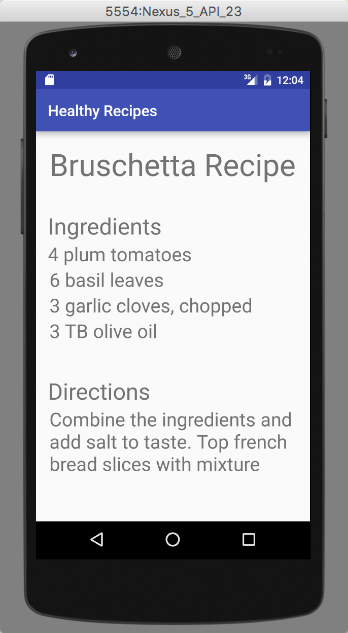

<!-- Technology logo picture and title -->
Android Studio projects</h1>

<!-- Technology welcome message -->
This directory holds some projects and practice examples that I worked on through native Android Studio.

I created some android phone applications that utilized features such as radio buttons, images, and avatar emoticons.

# Projects:

<h6>Click on the title link to see more information about each specific project.</h6>

[1- My Business Card App](https://github.com/lgc13/LucasCosta_portfolio/tree/master/android_studio/MyBusinessCard_app_project)

<!-- My Business Card app BIO -->
Using Android Studio, I created a small 2 pages app which is displayed on a Nexus 5 API. It uses avatar emoticons, picture imports and radio buttons. Upon clicking the "Details" radio button, this link will display the second page which displays some plain text with some of my contact info.


<!-- Code explanation -->
The majority of the hard work comes from extending the android support library AppCompatActivity. With this, I'm able to call upon methods for each specific thing that I'm trying to accomplish, like the setOnClickListener for my button. You can see some of the code here:

<!-- Code snippet -->
```java
protected void onCreate(Bundle savedInstanceState) {
    super.onCreate(savedInstanceState);
    setContentView(R.layout.activity_my_business_card);
    getSupportActionBar().setDisplayShowHomeEnabled(true);
    getSupportActionBar().setLogo(R.mipmap.ic_launcher);
    getSupportActionBar().setDisplayUseLogoEnabled(true);
    Button button = (Button) findViewById(R.id.button);
    button.setOnClickListener(new View.OnClickListener(){
        @Override
        public void onClick(View v){
            startActivity(new Intent(MyBusinessCard.this, Details.class));
        }
    });
}
```

[2- Bruschetta Recipe App](https://github.com/lgc13/LucasCosta_portfolio/tree/master/android_studio/Recipe_app_project)

<!-- Bruschetta Recipe app BIO -->
This was the first phone app that I made with Android Studio. I learned how to create a basic user interface using pictures, buttons, and different font texts.




<!-- Code explanation -->
Similarly as to how I completed my Business Card App, for this Recipe app I extended AppCompatActivity which allowed me to bring in many native features of Android Studio. Making apps have never been so easy!

```java
protected void onCreate(Bundle savedInstanceState) {
    super.onCreate(savedInstanceState);
    setContentView(R.layout.activity_main);
    Button button = (Button) findViewById(R.id.btnRecipe);
    button.setOnClickListener(new View.OnClickListener(){
        @Override
        public void onClick(View v){
            startActivity(new Intent(MainActivity.this, Recipe.class));
        }
    });
}
```

# Practice:

Although these were my biggest projects with Android Studio, I have worked on quite a lot more smaller projects, practice problems and trivia questions. You can see these by clicking this link:

[Practice Directory](https://github.com/lgc13/LucasCosta_portfolio/tree/master/android_studio/practice)

<!-- Contact info -->
# Let's Connect! Don't be shy...

Do you like what you see? Here are some other pages where you can get some more info, and/or connect with me!

<a href="lucas.gomes.costa@gmail.com"> Email: lucas.gomes.costa@gmail.com </a>

<a href="https://www.linkedin.com/in/lucas-gomes-costa/">  LinkedIn:  https://www.linkedin.com/in/lucas-gomes-costa/ </a>

<a href="https://lgc13.wordpress.com/"> Wordpress:   https://lgc13.wordpress.com/ </a>
