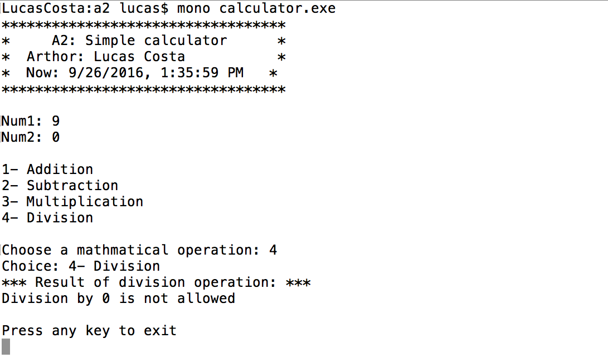

> **NOTE:** This README.md file should be placed at the **root of each of your repos directories.**
>
>Also, this file **must** use Markdown syntax, and provide project documentation as per below--otherwise, points **will** be deducted.
>

# LIS 4369 - Extensible Enterprise Solutions

## Lucas Costa

### Assignment 2 Requirements:

1. Backwards engineer (using .NET Core) the following console application screenshots:
2. Display short assignment requirements
3. Display *your* name as “author”
4. Display current date/time (must include date/time, your format preference)
5. Must perform and display each mathematical operation (example below).
6. Application logic that alerts the user indicating that division by
zero is not permitted.

#### README.md file should include the following items:

* Screenshot of valid operation running;
* Screenshot of invalid operation running;
* Screenshot of division by 0;

> This is a blockquote.
>
> This is the second paragraph in the blockquote.

##### Assignment Screenshots:

*Screenshot of valid operation running:

*Screenshot of invalid operation running:

*Screenshot of division by 0:

