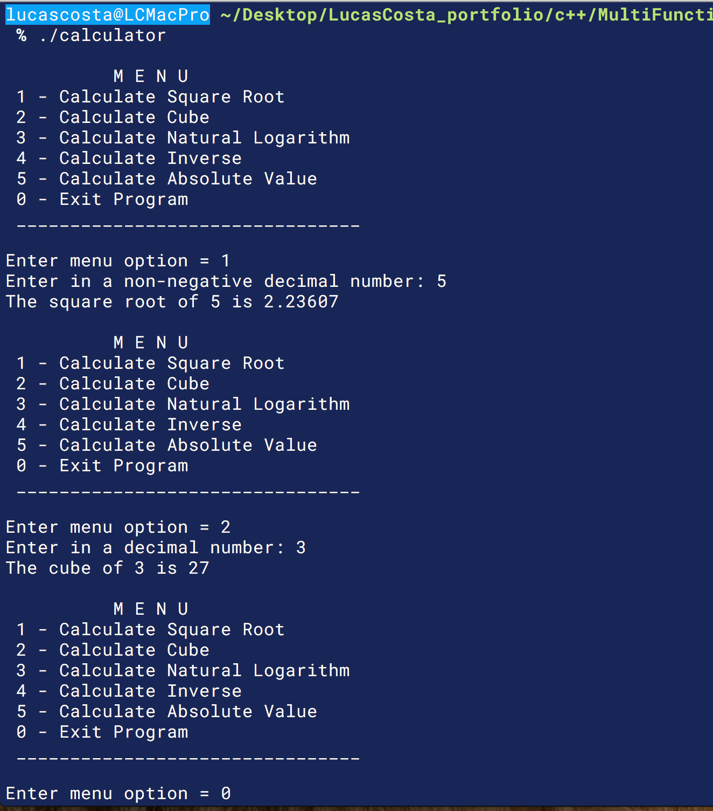

<div class="row">
  <div class="col-sm-4">
    <!-- Technology logo picture and title -->
    <h1>C++ projects</h1>
  </div>
  <div class="col-sm-8">
    <!-- Technology welcome message -->
    The majority of the projects and practice problems in this repo directory have great foundation concepts, that teach all the basic to intermediate skills that any programmer must have. For example: data types, creating and calling functions, mathematical equations, loops, classes, constructors, among others.

    C++ was the first official programming language that I ever learned. I was taught it during my sophomore year at Florida State University. Aside from all programming basic skills, I also learned how to critically think in order to solve problems, and create algorithms
  </div>
</div>


# Projects:

<h6>Click on the title link to see each project</h6>

[1- Tic Tac Toe Game App](https://github.com/lgc13/LucasCosta_portfolio/tree/master/c%2B%2B/TicTacToe_project)

<!-- Project BIO -->
"Small paragraph talking about what this project does with any particular key terms used to accomplish it"


<!--  -->

<!-- Code explanation -->
"BRIEF TALK ABOUT THE FOLLOWING CODE SNIPPET:"

<!-- Code snippet -->
```c++

cout << "test" << endl;

```

[2- Box Constructors App](https://github.com/lgc13/LucasCosta_portfolio/tree/master/c%2B%2B/Box_Constructors_project)

<!-- Project BIO -->
"Small paragraph talking about what this project does with any particular key terms used to accomplish it"


<!--  -->

<!-- Code explanation -->
"BRIEF TALK ABOUT THE FOLLOWING CODE SNIPPET:"

<!-- Code snippet -->
```c++

cout << "test" << endl;

```

[3- Multi Function Calculator App](https://github.com/lgc13/LucasCosta_portfolio/tree/master/c%2B%2B/MultiFunctionCalculator_project)

<!-- Project BIO -->
"Small paragraph talking about what this project does with any particular key terms used to accomplish it"


<!--  -->

<!-- Code explanation -->
"BRIEF TALK ABOUT THE FOLLOWING CODE SNIPPET:"

<!-- Code snippet -->
```c++

cout << "test" << endl;

```


<!-- Practice section -->
# Practice:

Although these were my biggest projects with C++, I have worked on quite a lot more smaller projects, practice problems and trivia questions. You can see these by clicking this link:

[Practice Directory](https://github.com/lgc13/LucasCosta_portfolio/tree/master/c%2B%2B/practice)

<br>
- Reminder to self:

To compile and build c++ files, use the following cmd:

```c++
g++ file_name.cpp -o file_name
```

If there are more files (classes) that are linked to this, do the following:

```c++
g++ file_name.cpp file_class.cpp file_class2.cpp -o file_name
```

Further instructions can be found here:
[Link](https://www.dvc.edu/academics/departments/computer-science/pdfs/UsingAppleXCode.pdf)
