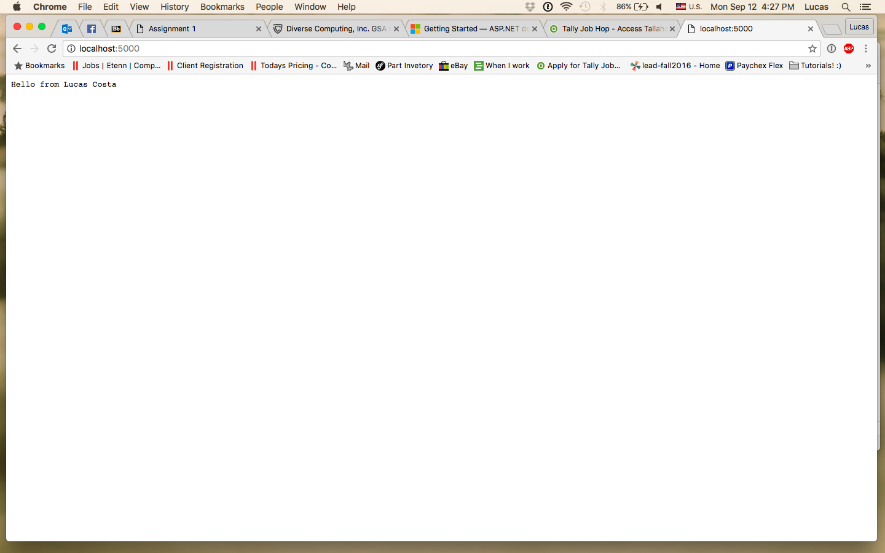

> **NOTE:** This README.md file should be placed at the **root of each of your repos directories.**
>
>Also, this file **must** use Markdown syntax, and provide project documentation as per below--otherwise, points **will** be deducted.
>

# LIS 4369 - Extensible Enterprise Solutions

## Lucas Costa

### Assignment 1 Requirements:

1. Distributed Version Control with Git and Bitbucket, and Development Environments
2. Development Installation:
3. Bitbucket repo

#### README.md file should include the following items:

* Screenshot of hwapp application running (#1 above);
* Screenshot of aspnetcoreapp application running (#2 above);
* git commands w/short descriptions (“Creating a New Repository” above);
Bitbucket repo links: a) this assignment and b) the completed tutorial repos above (bitbucketstationlocations and myteamquotes).

> This is a blockquote.
>
> This is the second paragraph in the blockquote.

##### Part 1 questions:
a. What files does ssh-keygen produce?
  id_rsa and id_rsa.pub
b. Where does this program store these files?
  Users/Lucas/.ssh/id_rsa

> #### Git commands w/short descriptions:

1. git init - initializes the git by adding .git to the directory.
2. git status - determines in which state the files are in.
3. git add - this begins to track a new file
4. git commit - commits changes on files recording a snapshot of the project at that given moment.
5. git push - pushes the project upstream.
6. git pull - this incorporates changes from the repo onto the current branch
7. git rm - removes project

##### Assignment Screenshots:

*Screenshot of of hwapp application running:

*Screenshot of aspnetcoreapp application running:

#### Tutorial Links:

*Bitbucket Tutorial - Station Locations:*
[A1 Bitbucket Station Locations Tutorial Link](https://bitbucket.org/lgc13/bitbucketstationlocation/"Bitbucket Station Locations")

*Tutorial: Request to update a teammate's repository:*
[A1 My Team Quotes Tutorial Link](https://bitbucket.org/lgc13/myteamquotes/"My Team Quotes Tutorial")
