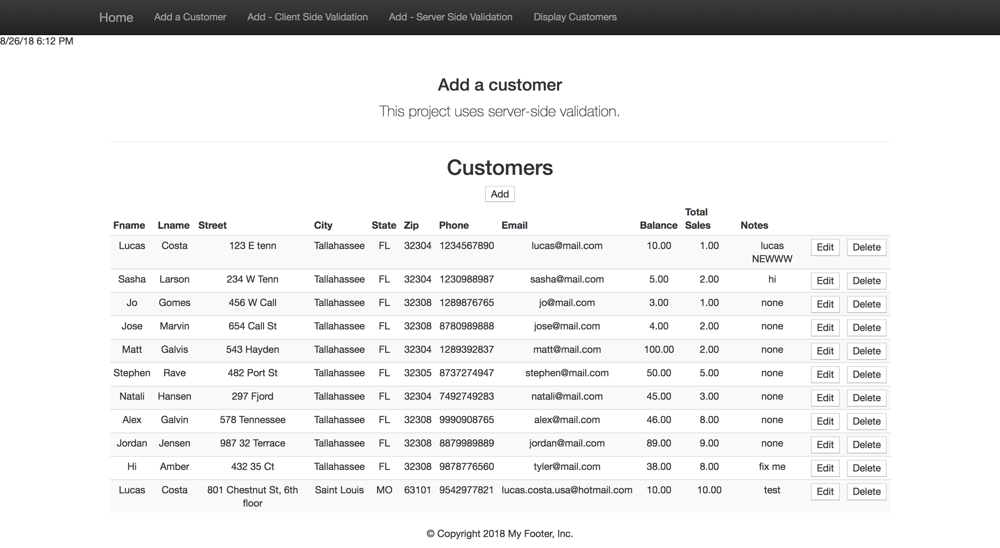
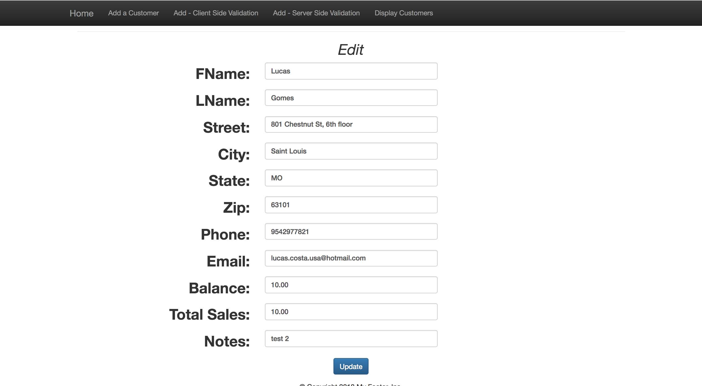
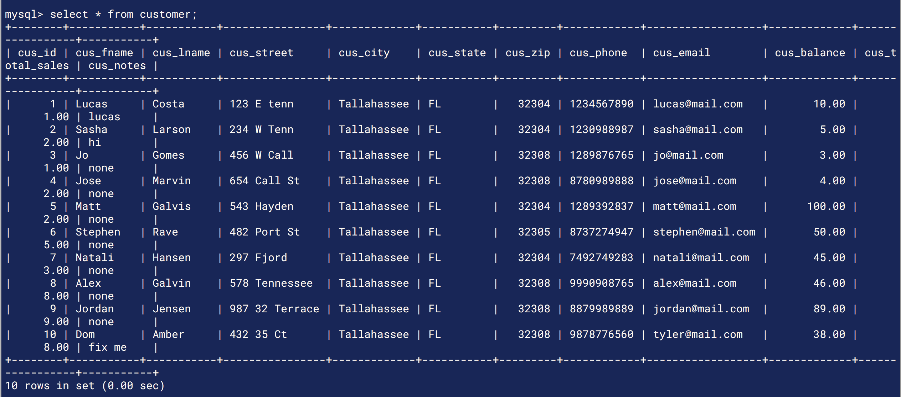

# Customer Store project
<!-- Project BIO -->
This is a basic full stack application which allows a user (a manager) to add a customer to their company's database. The manager can add a customer with information such as name, address, email, among others, which all are checked by both client and server side validations prior to being put onto the database. The manager can also see all the current customers that are in the list, as well as edit or delete any of them.

This application displays some of my skills with:

- MVC framework with JSP/JSTL/Java Servlets
- Local host SQL connection
- Prepared Statements for SQL injections
- Full CRUD (Create, Read, Update, Delete) functionality
- Client and Server side data validations

<!-- Screenshots -->






<!-- Code explanation -->
One really cool benefit of using JSP pages, is that you have access to JSTL. Using its prefix="c", I am able to create a forEach loop within my JSP page, in order to iterate through all the "users" that are in my database and display them to the page. Therefore, I can use my servlet request to print all of those users attributes such as fname, lname, city, etc.

<!-- Code snippet -->
You can see that in this code snippet:

```jsp

<%@ taglib uri="http://java.sun.com/jsp/jstl/core" prefix="c" %>
<c:forEach var="user" items="${users}">
  <tr>
    <td><c:out value="${user.fname}" /></td>
    <td><c:out value="${user.lname}" /></td>
    <td><c:out value="${user.street}" /></td>
    <td><c:out value="${user.city}" /></td>
    <td><c:out value="${user.state}" /></td>
    <td><c:out value="${user.zip}" /></td>
    <td><c:out value="${user.phone}" /></td>
    <td><c:out value="${user.email}" /></td>
    <td><c:out value="${user.balance}" /></td>
    <td><c:out value="${user.totalSales}" /></td>
    <td><c:out value="${user.notes}" /></td>

```

- Reminder to self:

In order to run on local Apache tomcat, project must be within these directories:

/Applications/AMPPS/mysql/bin
/Applications/tomcat/webapps

<!-- Adding a blank line -->
<br>

<!-- Back to Projects folder -->
<a href="https://github.com/lgc13/LucasCosta_portfolio/tree/master/java/" class="previous">&laquo; Back to Java projects</a>
