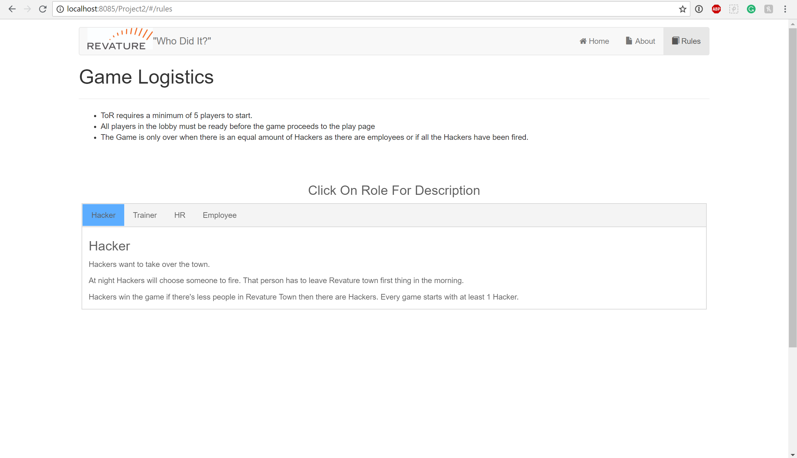
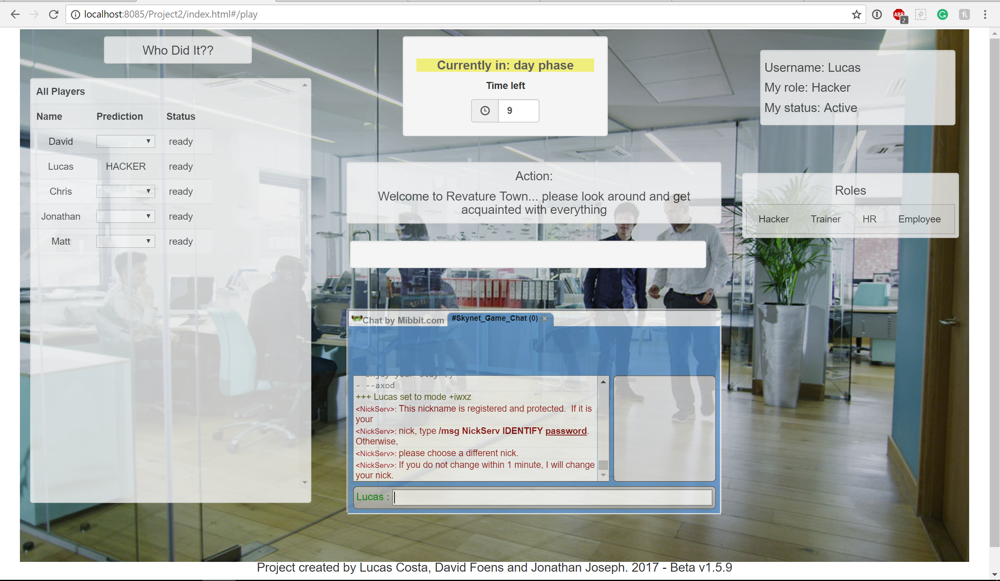
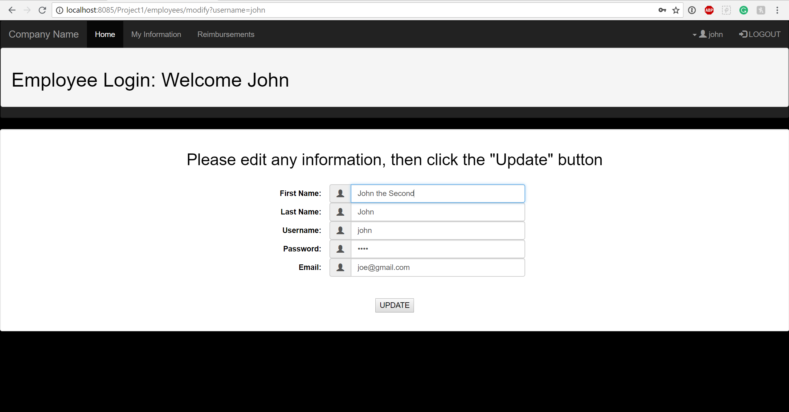
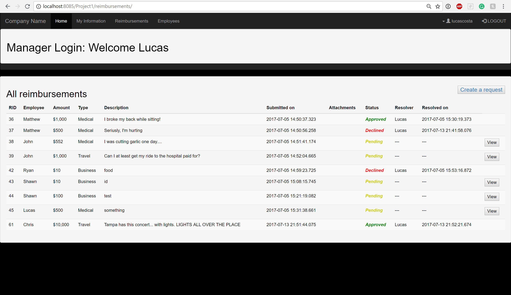
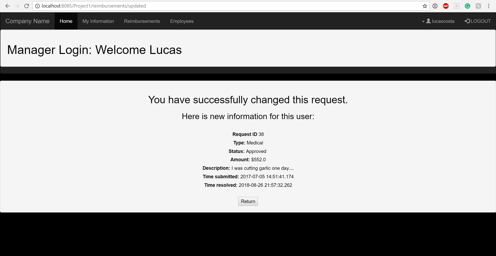

<!-- Technology logo picture and title -->

<h1>Java projects</h1>

<!-- Technology welcome message -->
Java is one of the main technologies I have worked with. I was first introduced to it at Florida State University where I created some console applications. Through its use of object oriented programming, I have made some other applications that run on Apache Tomcat with JSP/JSTL pages running on servlets. I also use Spring MVC with Hibernate, tying that together to some other JavaScript libraries such as AngularJS in order to make single page applications.

<h6>Click the title links if you want to see more details about a particular project.</h6>

<!-- Project section -->
<h2><a href="https://github.com/lgc13/LucasCosta_portfolio/tree/master/java/RevatureTown_project">1- Revature Town</a></h2>

<!-- Project BIO -->
Revature Town is an entertainment based 'Single Page Application' which allows many people to play together online, at the same time. This app is very similar to other well known games: Werewolf or Mafia. In our version of the game, Hackers have infiltrated Town Revature and they are trying to fire all employees! By talking to people through a live chat, voting on users to 'fire', and working together with other roles such as a Trainer or HR, players can enjoy a live game - up until they get fired!

This app was made in roughly 2 weeks, by me and two other team members: David Foens and Jonathan Joseph.

This application displays some of my skills with:

- Amazon Web Services (AWS) full pipeline
- Spring MVC with Hibernate
- AngularJS views and controllers (single page app)
- REST API calls
- Live chat API import

<!-- Screenshots -->








<!-- Code explanation -->
My team and I use Hibernate configurations in order to set up all the database configurations, controllers, and classes. We also put all of this on a live EC2 through AWS (no longer live) where we were able to deploy a full pipeline using Jenkins.

<!-- Code snippet -->
You can see that in this code snippet:

```xml

<!-- DB Configuration -->
<property name="hibernate.connection.driver_class">oracle.jdbc.OracleDriver</property>
<property name="hibernate.dialect">org.hibernate.dialect.Oracle10gDialect</property>
<property name="hibernate.connection.url">jdbc:oracle:thin:@project2.cvn2sbvqpuhu.us-east-2.rds.amazonaws.com:1521:orcl</property>


<!-- Mapping CLASSES with hibernate -->
<mapping class="com.revature.bean.Roles" />
<mapping class="com.revature.bean.Status" />
<mapping class="com.revature.bean.Users" />

```


<!-- Code explanation -->
AngularJS can be used to create single page applications. For this project, I use ngRoute and locationProvider to check the path. routeProvider can call upon a specific templateUrl  and controller depending on this path - afterwards, the browser will render this 'view' with any given information that we can get by making REST calls.

<!-- Code snippet -->
You can see that in this code snippet:

```js

var myApp = angular.module('myApp', ['ngRoute']);

//this will remove the URL prefix
myApp.config(['$locationProvider', function($locationProvider) {
	  $locationProvider.hashPrefix('');
	}]);


  myApp.config(function($routeProvider) {

  	$routeProvider

    .when('/', {
      templateUrl : 'pages/home.html',
      controller  : 'HomeController'
    })

    .when('/about', {
      templateUrl : 'pages/about.html',
      controller  : 'AboutController'
    })
  }


```

<!-- comment -->


<!-- Code explanation -->
With Hibernate, we are able to easily query through our database and get any needed information. Using a session object, we can execute a hql query to return a list of users from the database which we can then pass on to other calls within our program.

<!-- Code snippet -->
You can see that in this code snippet:

```java

@Override
public List<Users> getUsers() {
  Session session = HibernateUtil.getSession();
  Query query;
  String hql;
  //Transaction tx;

  hql = "FROM com.revature.bean.Users";
  query = session.createQuery(hql);
  @SuppressWarnings("unchecked")
  List<Users> users = query.list(); //list executes the query and returns results
  session.close();
  return users;
}

```

<!-- ......................E N D  O F  P R O J E C T........................ -->

<!-- Project section -->
<h2><a href="https://github.com/lgc13/LucasCosta_portfolio/tree/master/java/Reimbursements_project">2- Reimbursement app project</a></h2>

<!-- Project BIO -->
This application is made to be used in a professional environment, where employees and managers can request reimbursements for job related things. Employees and managers can login, see and change their personal info(such as name, username, and password), and also submit reimbursement requests. Managers have additional features that are only available for them, such as vieweing all employees, changing any employee's information, accepting and denying employee's reimbursement requests.

This application displays some of my skills with:

- Full MVC (Model-View-Controller)
- User authentication (Employee vs Manager views)
- Use of GET/POST Request methods
- Oracle Database query
- JSP/JSTL use for dynamic web pages

<!-- Screenshots -->








<!-- Code explanation -->
This is a very straight forward application which needs some basic types of methods, such as one to create an employee, one to select the employee by username (can be used when logging in), selecting all employees from the database onto an Array List, and also others to edit the employee. By having an interface with these methods, it is very easy to keep track of how I can query through my Oracle database.

<!-- Code snippet -->
You can see that in this code snippet:

```java

public interface UserDAO {

	public void createEmployee(EmployeeObject employee);
	public EmployeeObject selectEmployeeByUsername(String username);
	public EmployeeObject selectEmployeeById(int id);
	public ArrayList<EmployeeObject> selectEmployee();
	public ArrayList<EmployeeObject> selectAllEmployees();
	public EmployeeObject updateEmployee(EmployeeObject employee);
	public void deleteEmployeeById(int id);

}


```

<!-- Code explanation -->
When a person is trying to login, I can use the input username to double check on my database along with its password. I can also do some simple server side validation where if the person object is blank to begin with, I can just deny them access. In addition, by getting the entire person's object, I'll have access to their "role", whether that's an "employee" or "manager", allowing me to create a different page view depending on that attribute.

<!-- Code snippet -->
You can see that in this code snippet:


```java

person = userDao.selectEmployeeByUsername(username);

if (person!=null)
{
  if (username.equals(person.getUser_username()) && pass.equals(person.getUser_password()))
  {
    return person;
  }
  else {
    System.out.println("Validate Login - Received null emp");
    return null;
  }
}
else
{
  return null;
}

```

<!-- ......................E N D  O F  P R O J E C T........................ -->
<!-- Project section -->
<h2><a href="https://github.com/lgc13/LucasCosta_portfolio/tree/master/java/CustomerStore_project">3- Customer Store project</a></h2>

<!-- Project BIO -->
This is a basic full stack application which allows a user (a manager) to add a customer to their company's database. The manager can add a customer with information such as name, address, email, among others, which all are checked by both client and server side validations prior to being put onto the database. The manager can also see all the current customers that are in the list, as well as edit or delete any of them.

This application displays some of my skills with:

- MVC framework with JSP/JSTL/Java Servlets
- Local host SQL connection
- Prepared Statements for SQL injections
- Full CRUD (Create, Read, Update, Delete) functionality
- Client and Server side data validations

<!-- Screenshots -->


<!-- Code explanation -->
One really cool benefit of using JSP pages, is that you have access to JSTL. Using its prefix="c", I am able to create a forEach loop within my JSP page, in order to iterate through all the "users" that are in my database and display them to the page. Therefore, I can use my servlet request to print all of those users attributes such as fname, lname, city, etc.

<!-- Code snippet -->
You can see that in this code snippet:

```jsp

<%@ taglib uri="http://java.sun.com/jsp/jstl/core" prefix="c" %>
<c:forEach var="user" items="${users}">
  <tr>
    <td><c:out value="${user.fname}" /></td>
    <td><c:out value="${user.lname}" /></td>
    <td><c:out value="${user.street}" /></td>
    <td><c:out value="${user.city}" /></td>
    <td><c:out value="${user.state}" /></td>
    <td><c:out value="${user.zip}" /></td>
    <td><c:out value="${user.phone}" /></td>
    <td><c:out value="${user.email}" /></td>
    <td><c:out value="${user.balance}" /></td>
    <td><c:out value="${user.totalSales}" /></td>
    <td><c:out value="${user.notes}" /></td>

```

<!-- ......................E N D  O F  P R O J E C T........................ -->

<!-- Practice section -->
# Practice:

Although these were my biggest projects with Java, I have worked on a lot of other smaller projects, practice problems and trivia questions. You can see these by clicking this link:

[Practice Directory](https://github.com/lgc13/LucasCosta_portfolio/tree/master/java/practice)

<!-- Contact info -->
# Let's Connect! Don't be shy...

Do you like what you see? Here are some other pages where you can get some more info, and/or connect with me!

<a href="mailto:lucas.gomes.costa@gmail.com"></a> Email: lucas.gomes.costa@gmail.com

<a href="https://www.linkedin.com/in/lucas-gomes-costa/"> </a> LinkedIn: <a href="https://www.linkedin.com/in/lucas-gomes-costa/">  https://www.linkedin.com/in/lucas-gomes-costa/ </a>

<a href="https://lgc13.wordpress.com/"></a> Wordpress: <a href="https://lgc13.wordpress.com/">  https://lgc13.wordpress.com/ </a>

<!-- Adding a blank line -->
<br>

<!-- Back to LucasCosta_portfolio folder  -->
<a href="https://github.com/lgc13/LucasCosta_portfolio/tree/master/" class="previous">&laquo; Back to LucasCosta_portfolio</a>
