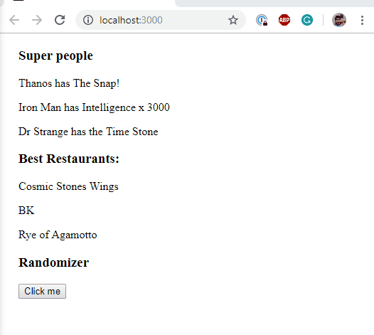

# Day 2

## Styling, Conditional Rendering and Lists

Follow these [instructions](./conditionals-and-lists)

Demo:

## Class Components and State

Follow these [instructions](./class-components-and-state)

Demo:

## Lifting State Up

Follow these [instructions](./lifting-state-thermormeter)

Demo:

## Practice

- Let's create 2 small apps using everything you just learned (class, components, state)

1. coin flip

- a small game where the user can choose heads or tails, and you will randomize the result, letting the user know whether they won or not

2. rock-paper-sizors

- similar to the coin flip, but this time the user can choose between rock, paper or scissors. You will randomize the result, letting the user know whether they won, lost, or if it was a tie.

Something along these lines:

