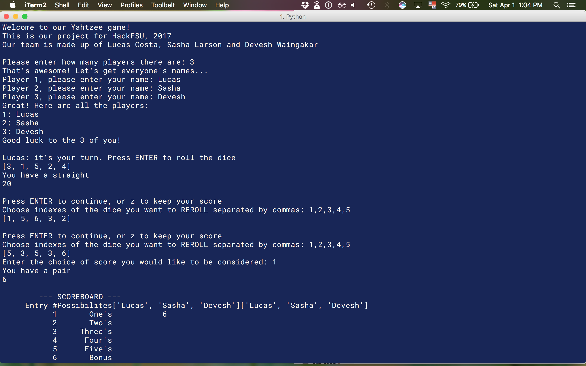

<!-- Technology logo picture and title -->

<h1>Python projects</h1>

<!-- Technology welcome message -->
Python is one of the main technologies that I use. One of my best friends, Chris, introduced me to this easy syntax, object oriented programming language during my studies at Florida State University. I really enjoy Python, given how easy, clean, and intuitive it is. I also prefer to use Python whenever I work on any of my personal projects.

Currently, I am working on expanding my skills by creating a full stack application with Flask, and Django. Also, I teach Python at LaunchCode, a non-profit organization that focuses on teaching programming skills to people who have never done it before.

<h6>Click the title links if you want to see more details about a particular project.</h6>

<!-- Project section -->
<h2><a href="https://github.com/lgc13/LucasCosta_portfolio/tree/master/python/YahtzeeGame_project">1- Yahtzee Game</a></h2>

<!-- Project BIO -->
This is a console application that allows users to play Yahtzee, a fun game where they can roll dice and add up points. The game starts off asking for the amount of players, and allows each to input their own name. Afterwards, each player can take turns rolling the dice up to 3 times, being able to edit them at any point. At the end of the turn, that player's points are added up to their total. The person with the highest points, wins!

This project was done during a 2-day Hackathon at FSU, in collaboration with 2 other team mates, Sasha Larson and Devesh.

This application displays some of my skills with:

- Object Oriented Programming
- User input validation
- Lists and Dictionaries
- Using external modules
- Mathematical Algorithms

<!-- Screenshots -->


<!-- Code explanation -->
To randomize the dice rolls, we import the random module which has a randint method. Here, we iterate through each player, randomizing the values of the dice, then appending them onto a list which we can display to the console.

<!-- Code snippet -->
You can see that in this code snippet:

```python

for i in names:
      raw_input("\n%s: it's your turn. Press ENTER to roll the dice" % i)
      for i in range(diceMaxLength):
          dice.append(random.randint(1,6))
      print dice

```

<!-- ......................E N D  O F  P R O J E C T........................ -->

<!-- Project section -->
<h2><a href="https://github.com/lgc13/LucasCosta_portfolio/tree/master/python/RingOfFire_project">2- Ring of Fire</a></h2>

<!-- Project BIO -->
This is a console game application that can be played by a group of friends at a single computer. The purpose of this application, is to allow people to play the 'Ring of Fire' game, without having to carry on a deck of cards, or remembering each specific rule. This game application does all the heavy lifting, telling each player what they should do next. Players take turns taking a virtual card, which is followed by some type action that must be taken. This is a drinking game, so expect to have fun :)

This application displays some of my skills with:

- Object Oriented Programming
- Importing modules
- Use of Lists and Dictionaries
- Method calls
- Mathematical Algorithms

<!-- Screenshots -->


<!-- Code explanation -->
I use itertools in order to more easily distribute my deck of cards without having to repeat myself. This allows me to give each card number (Ace through King) 4 different suits (Diamond, Spades, Hearts and Clubs)

<!-- Code snippet -->
You can see that in this code snippet:

```python

self.deck = list(itertools.product(['Ace', '2', '3', '4', '5', '6', '7', '8', '9', '10', 'Jack', 'Queen', 'King'],['Diamond','Spades','Hearts','Club']))

```

<!-- ......................E N D  O F  P R O J E C T........................ -->

<!-- Practice section -->
# Practice:

Although these were my biggest projects with Python, I have worked on a lot of other smaller projects, practice problems and trivia questions. You can see these by clicking this link:

[Practice Directory](https://github.com/lgc13/LucasCosta_portfolio/tree/master/python/practice)

<!-- Contact info -->
# Let's Connect! Don't be shy...

Do you like what you see? Here are some other pages where you can get some more info, and/or connect with me!

<a href="mailto:lucas.gomes.costa@gmail.com"></a> Email: lucas.gomes.costa@gmail.com

<a href="https://www.linkedin.com/in/lucas-gomes-costa/"> </a> LinkedIn: <a href="https://www.linkedin.com/in/lucas-gomes-costa/">  https://www.linkedin.com/in/lucas-gomes-costa/ </a>

<a href="https://lgc13.wordpress.com/"></a> Wordpress: <a href="https://lgc13.wordpress.com/">  https://lgc13.wordpress.com/ </a>

<!-- Adding a blank line -->
<br>

<!-- Back to LucasCosta_portfolio folder  -->
<a href="https://github.com/lgc13/LucasCosta_portfolio/tree/master/" class="previous">&laquo; Back to LucasCosta_portfolio</a>
