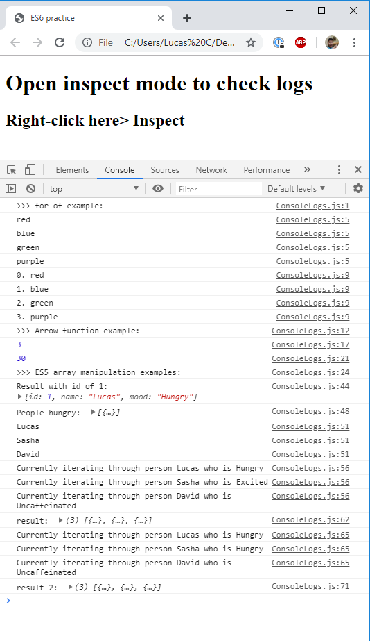

# Day 1 topics

## Install Yarn

This can be time consuming, so let's get it started and move on to the next few topics.

1. Install Brew

Check if you already have it installed:

`brew -version`

If you don't, install it from here: https://brew.sh/

2. Install Node

Check if you already have it installed

`node --version`

If you don't have it installed, go ahead and install it now:

`brew install node`

3. Install Yarn

Check if you already have it installed

`yarn --version`

If you don't have it, first try installing it with brew:

`brew install yarn`

If that doesn't work, then install it from this link: [Yarn](https://yarnpkg.com/latest.msi)

If necessary, here's Node's link: [Node.js](https://nodejs.org/en/)

## Wiki

Talk about why/how to create and use one.

## ES6

Follow this guide:

[Example](./es6-practice)

Demo:


## Babel

[Babel docs](https://babeljs.io/docs/en/)

- TLDR: Toolchain that converts ES6 into older versions of JS. Ex:

```js
// Babel Input: ES2015 arrow function
[1, 2, 3].map((n) => n + 1);

// Babel Output: ES5 equivalent
[1, 2, 3].map(function(n) {
  return n + 1;
});
```

[See it in action](https://babeljs.io/repl/#?presets=react&code_lz=GYVwdgxgLglg9mABACwKYBt1wBQEpEDeAUIogE6pQhlIA8AJjAG4B8AEhlogO5xnr0AhLQD0jVgG4iAXyJA)

## React

[React](https://reactjs.org/) is a popular JavaScript library for building user interfaces. Its simple core concepts make the library a useful base for building applications for a variety of platforms, including both web and mobile interfaces. Its popularity and widespread adoption have resulted in a large community that has produced libraries and plugins that make working with React a pleasure.

- Components: encapsulate code to smaller isolated pieces, so its more maintainable and dynamic.
- Declarative (efficiently update and render components as data changes)

## Hello World

- Let's make a very simple [Hello World React App](./hello-world-no-yarn).

Demo:


## Hello World with create-react-app

- Now let's use [yarn create-react-app](./hello-world-create-react-app)

Demo:


## JSX, Components and Props

- Follow these [instructions](./jsx-components-and-props)

Demo:


## Practice

Let's create an 'About me' small app that uses functional components, and props. This should have hard coded data to display to the user. The data will not be mutable.
