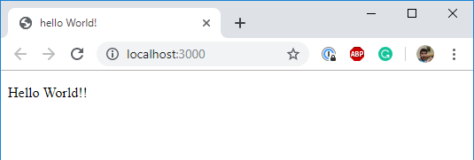

# Hello World with create-react-app

Demo:



React Docs [(Instructions)](https://github.com/facebook/create-react-app)

1. Run `yarn create react-app your-app-name`

- if you come across an issue like `is not recognized as an internal or external command, operable program or batch file`, then run the following:

```sh
yarn global add create-react-app
create-react-app your-app-name
```

2. Run your app

```sh
cd your-app-name
yarn start
```

- This will run your app on localhost:3000

## First look

- for now, focus attention on public/index.html, src/index.js and src/App.js
- also notice that these files are imported in the src/index.js file

File structure: https://facebook.github.io/create-react-app/docs/folder-structure

1. React

- Allows usage of JSX elements

`import React from 'react';`

2. ReactDom

- Allows us to render through its render()

`import ReactDOM from 'react-dom';`

- ReactDom.render() takes 2 args: itemToBeRendered and locationToRender. Ex:

```js
ReactDOM.render(
  <ComponentName {...props} />,
  document.getElementById('root') // <div id="root"></div>
);
```

- For a simple `Hello World` app, you can change your index.js to have the following:

```js
import React from 'react';
import ReactDOM from 'react-dom';

function App() {
  return (
    <div>
      <p> Hello World!! </p>
    </div>
  );
}

ReactDOM.render(
  <App />,
  document.getElementById('root')
);
```
