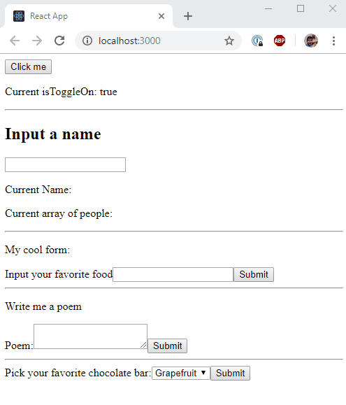
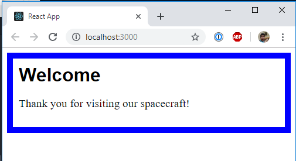

# Day 3

## Handling Events and Forms

Follow these [instructions](./events-and-forms)

Demo:

## Composition vs Inheritance

Follow these [instructions](./composition-and-inheritance)

Demo:

## Thinking in React

[Read me!](https://reactjs.org/docs/thinking-in-react.html)

## Practice

- Let's create a Todo List App using all the skills we learned

Follow the instructions given [here](https://github.com/QDivision/todo-js), but using React rather than plain JS.

Something along these lines:

