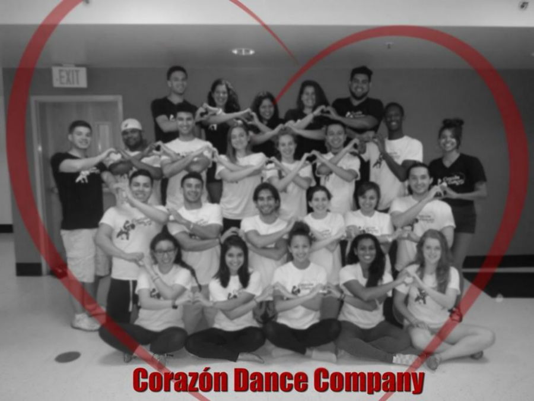

# Corazon project

<!-- Project BIO -->
This is a static web site that I created for a Salsa group that I was a member of while at FSU - Corazon Salsa Dancers. This web site aims to show information about the group, such as their purpose, history, and contact information. Someone going on this web site should also be able to see pictures, upcoming events, and information on how to join.

This application displays some of my skills with:

- Bootstrap features
- JavaScript
- Carousel Slideshow
- CSS classes and IDs
- HTML development

<!-- Screenshots -->


<!-- Code explanation -->
Bootstrap has a lot of nifty features, such a the grid system that allows me to organize my website with rows and columns within Divs. Another nice thing, is the "carousel". Using some of their CSS and JS, I am able to easily create an ongoing carousel slide show which displays any pictures and text that I input

<!-- Code snippet -->
You can see that in this code snippet:

```html

<div id="myCarousel" class="carousel slide" data-ride="carousel">
  <!-- Indicators -->
  <ol class="carousel-indicators">
    <li data-target="#myCarousel" data-slide-to="0" class="active"></li>
    <li data-target="#myCarousel" data-slide-to="1"></li>
    <li data-target="#myCarousel" data-slide-to="2"></li>
    <li data-target="#myCarousel" data-slide-to="3"></li>
  </ol>
  <div class="carousel-inner">
    <div class="item active">
      
      <div class="container">
        <div class="carousel-caption">
          <h1>Corazon Dancers</h1>
          <p>Latin L.A. Salsa</p>
          <p><a class="btn btn-lg btn-primary" href="#" role="button">Sign up today</a></p>
        </div>
      </div>
    </div>

```

<!-- Adding a blank line -->
<br>

<!-- Back to Projects folder -->
<a href="https://github.com/lgc13/LucasCosta_portfolio/tree/master/web_dev/" class="previous">&laquo; Back to Web Dev projects</a>
