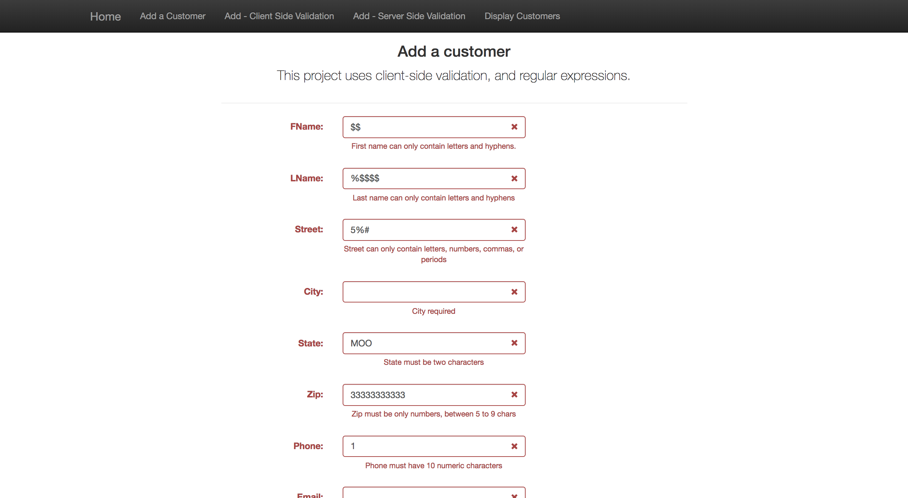
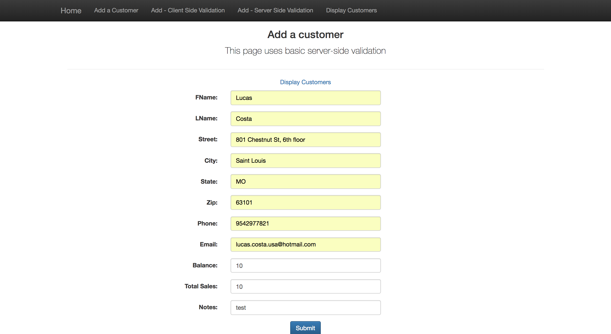
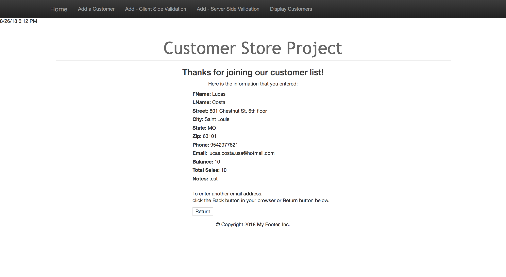

# Customer Store project
<!-- Project BIO -->
This is a basic full stack application which allows a user (a manager) to add a customer to their company's database. The manager can add a customer with information such as name, address, email, among others, which all are checked by both client and server side validations prior to being put onto the database. The manager can also see all the current customers that are in the list, as well as edit or delete any of them.

This application displays some of my skills with:

- MVC framework with JSP/JSTL/Java Servlets
- Local host SQL connection
- Prepared Statements for SQL injections
- Full CRUD (Create, Read, Update, Delete) functionality
- Client and Server side data validations

<!-- Screenshots -->





<!-- Code explanation -->
"BRIEF TALK ABOUT THE FOLLOWING CODE SNIPPET:"

<!-- Code snippet -->
You can see that in this code snippet:

```LANGUAGE_NAME

PASTE CODE HERE

```

<!-- Adding a blank line -->
<br>

<!-- Back to Projects folder -->
<a href="https://github.com/lgc13/LucasCosta_portfolio/tree/master/web_dev/" class="previous">&laquo; Back to Web Dev projects</a>

- Remider to self:

In order to run on local Apache tomcat, project must be within these directories:

/Applications/AMPPS/mysql/bin
/Applications/tomcat/webapps
