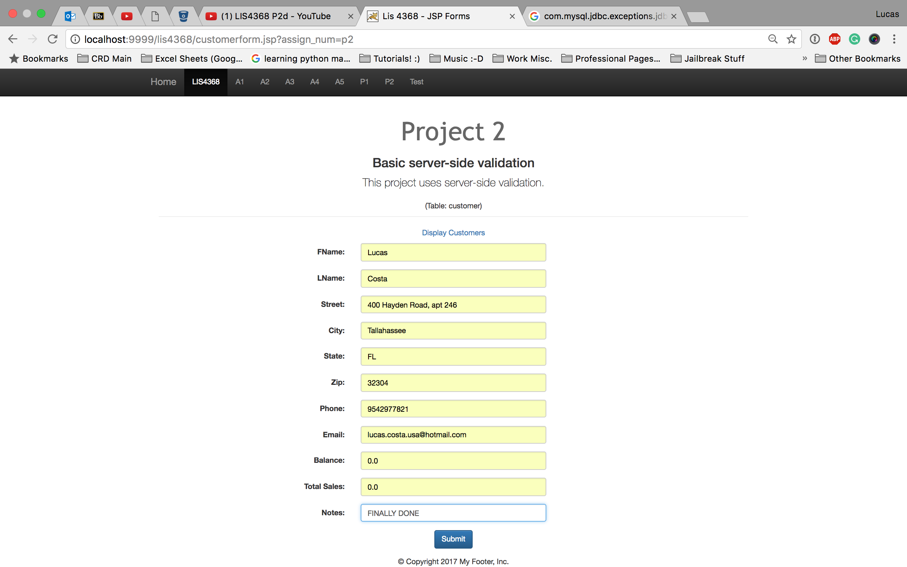
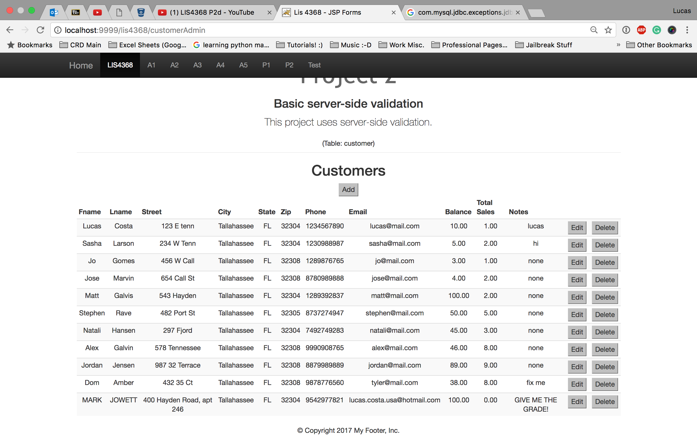

> **NOTE:** This README.md file should be placed at the **root of each of your repos directories.**
>
>Also, this file **must** use Markdown syntax, and provide project documentation as per below--otherwise, points **will** be deducted.
>

# LIS 4381 - Mobile Web Application Development

## Lucas Costa

### Project 2:

1. Course Title, my name, assignment requirements as per A1
2. MVC framework
3. Client-side server validation
4. Prepared Statements for SQL injections
5. JSTL to prevent XSS
6. Full CRUD functionality

#### README.md file should include the following items:

* Screenshot of Valid User Form Entry (customerform.jsp)
* Screenshot of Passed Validation (thanks.jsp)
* Screenshot of Display Data (modify.jsp)
* Screenshot of Modify Form (customer.jsp)
* Screenshot of Modified Data (modify.jsp)
* Screenshot of Delete Warning (modify.jsp)
* Screenshot of Associated Database Changes (Select, Insert, Update, Delete)

> This is a blockquote.
>
> This is the second paragraph in the blockquote.

##### Assignment Screenshots:

* Screenshot of Valid User Form Entry (customerform.jsp)

* Screenshot of Passed Validation (thanks.jsp)

* Screenshot of Display Data (modify.jsp)

* Screenshot of Modify Form (customer.jsp)

* Screenshot of Modified Data (modify.jsp)

* Screenshot of Delete Warning (modify.jsp)

* Screenshot of Associated Database Changes (Select, Insert, Update, Delete)

