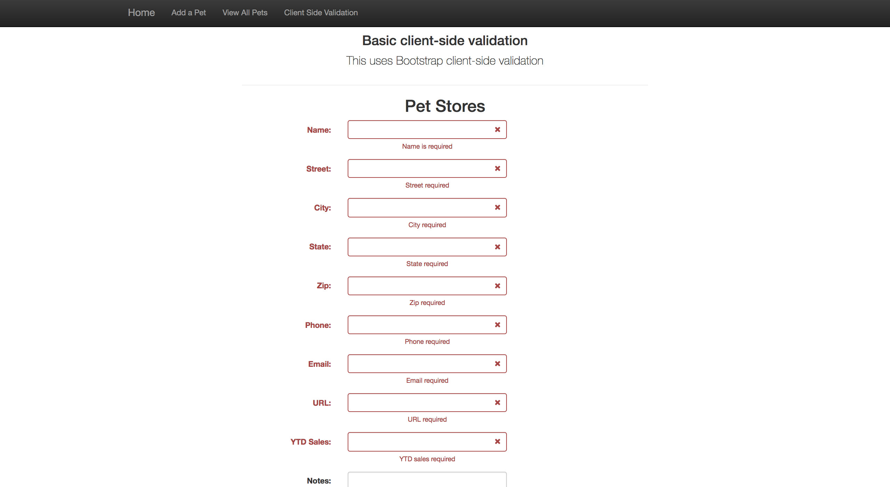
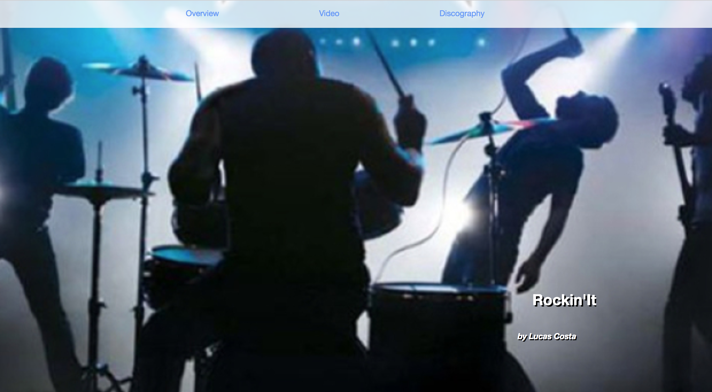

<!-- Technology logo picture and title -->

<h1>Web Dev projects</h1>

<!-- Technology welcome message -->
I learned the main Web Development concepts during high school and college, where I created some simple static web pages with HTML, CSS, Bootstrap, and JavaScript. Soon after that, I picked up skills to create dynamic web pages which utilized PHP or JSP files, running through HTTP servers such as Apache and Tomcat. I made some dynamic projects which display my use of these skills along with Databases such as MySQL and Oracle.

<h6>Click the title links if you want to see more details about a particular project.</h6>

<!-- Project section -->
<h2><a href="https://github.com/lgc13/LucasCosta_portfolio/tree/master/web_dev/Corazon_project">1- Corazon Dancers project</a></h2>

<!-- Project BIO -->
This is a static website that I created for a Salsa group that I was a member of while at FSU - Corazon Salsa Dancers. This website aims to show information about the group, such as their purpose, history, and contact information. Someone going on this website should also be able to see pictures, upcoming events, and information on how to join.

This application displays some of my skills with:

- Bootstrap features
- JavaScript
- Carousel Slideshow
- CSS classes and IDs
- HTML development

<!-- Screenshots -->


<!-- Code explanation -->
Bootstrap has a lot of nifty features, such a the grid system that allows me to organize my website with rows and columns within Divs. Another nice thing, is the "carousel". Using some of their CSS and JS, I am able to easily create an ongoing carousel slide show which displays any pictures and text that I input

<!-- Code snippet -->
You can see that in this code snippet:

```html

<div id="myCarousel" class="carousel slide" data-ride="carousel">
  <!-- Indicators -->
  <ol class="carousel-indicators">
    <li data-target="#myCarousel" data-slide-to="0" class="active"></li>
    <li data-target="#myCarousel" data-slide-to="1"></li>
    <li data-target="#myCarousel" data-slide-to="2"></li>
    <li data-target="#myCarousel" data-slide-to="3"></li>
  </ol>
  <div class="carousel-inner">
    <div class="item active">
      
      <div class="container">
        <div class="carousel-caption">
          <h1>Corazon Dancers</h1>
          <p>Latin L.A. Salsa</p>
          <p><a class="btn btn-lg btn-primary" href="#" role="button">Sign up today</a></p>
        </div>
      </div>
    </div>

```

<!-- ......................E N D  O F  P R O J E C T........................ -->

<!-- Project section -->
<h2><a href="https://github.com/lgc13/LucasCosta_portfolio/tree/master/web_dev/PetStore_project">2- Pet Store project</a></h2>

<!-- Project BIO -->
This application allows a user to handle a Pet Store web site. For example, the user can add "Pets" to the database. The user can also view, edit, and delete any of the current Pets in this same database on a different page. Some of these pages implement data validation on the user end(client side), while others have it on the back end(server side).

This application displays some of my skills with:

- Apache server application
- PHP development
- MySQL Database
- Client and Server Side validation (one uses Regular Expressions)
- Web Dev concepts (HTML, CSS, JS and Bootstrap)

<!-- Screenshots -->




<!-- Code explanation -->
I use some Regular Expressions in order to create Client Side validation for the user input. This helps prevent possible bad data, and SQL injections going into the Database. I also send messages to the browser letting the user know exactly what the issue is when they are trying to input invalid data.

<!-- Code snippet -->
You can see that in this code snippet:

```php

fields: {
    name: {
        validators: {
            notEmpty: {
                message: 'Name is required'
            },
            stringLength: {
                min: 1,
                max: 30,
                message: 'Name must be less than 30 characters long'
            },
            regexp: {
              //alphanumeric, hyphens, underscores, and spaces
              //regexp: /^[a-zA-Z0-9\-_\s]+$/,
              //similar to: (though, \w supports other Unicode characters)
                regexp: /^[\w\-\s]+$/,
              message: 'Name can only contain letters, numbers, hyphens, and underscore'
            },
        },
    },
  }

```

<!-- ......................E N D  O F  P R O J E C T........................ -->

<!-- Project section -->
<h2><a href="https://github.com/lgc13/LucasCosta_portfolio/tree/master/web_dev/RockinIt_project">3- Rockin' It project</a></h2>

<!-- Project BIO -->
This is a static web site which displays some information about Rock n' Roll! By opening this web site, a user can see information about Rock's history, some statistics of its genres, an imbedded Youtube video, and some other references. This is one of the first projects that I made using HTML, CSS, JS and Bootstrap.

This application displays some of my skills with:

- Bootstrap
- Imbedding videos onto HTML
- Div classes and Grid system
- Basic JavaScript concepts
- HTML and CSS

<!-- Screenshots -->



<!-- Code explanation -->
For this web site, I use a simple nav bar id from Bootstrap. This makes it very easy to have a well aligned, colorful, and adjustable nav bar. I also use href links for each nav bar list option, so that when clicked, the page will scroll down to find that specific area.


<!-- Code snippet -->

```html

<!--Navigation Bar holds Navigation Buttons -->
<div id="navbar">
	<div class="container">  <!-- container keeps everything aligned and centered no matter what the window size -->
		<ul id="menu">
			<!-- button class provides button-like appearance and scrolling javascript (see bottom of html code) -->
			<li><a href="#overview" class="button">Overview</a></li>
			<li><a href="#video" class="button">Video</a></li>
   		<li><a href="#discography" class="button">Discography</a></li>
		</ul>
	</div> <!-- end container -->
</div> <!-- end navbar -->

```

<!-- ......................E N D  O F  P R O J E C T........................ -->

<!-- Practice section -->
# Practice:

Although these were my biggest projects with Web Dev, I have worked on a lot of other smaller projects, practice problems and trivia questions. You can see these by clicking this link:

[Practice Directory](https://github.com/lgc13/LucasCosta_portfolio/tree/master/web_dev/practice)

<!-- Contact info -->
# Let's Connect! Don't be shy...

Do you like what you see? Here are some other pages where you can get some more info, and/or connect with me!

<a href="mailto:lucas.gomes.costa@gmail.com"></a> Email: lucas.gomes.costa@gmail.com

<a href="https://www.linkedin.com/in/lucas-gomes-costa/"> </a> LinkedIn: <a href="https://www.linkedin.com/in/lucas-gomes-costa/">  https://www.linkedin.com/in/lucas-gomes-costa/ </a>

<a href="https://lgc13.wordpress.com/"></a> Wordpress: <a href="https://lgc13.wordpress.com/">  https://lgc13.wordpress.com/ </a>

<!-- Adding a blank line -->
<br>

<!-- Back to LucasCosta_portfolio folder  -->
<a href="https://github.com/lgc13/LucasCosta_portfolio/tree/master/" class="previous">&laquo; Back to LucasCosta_portfolio</a>
