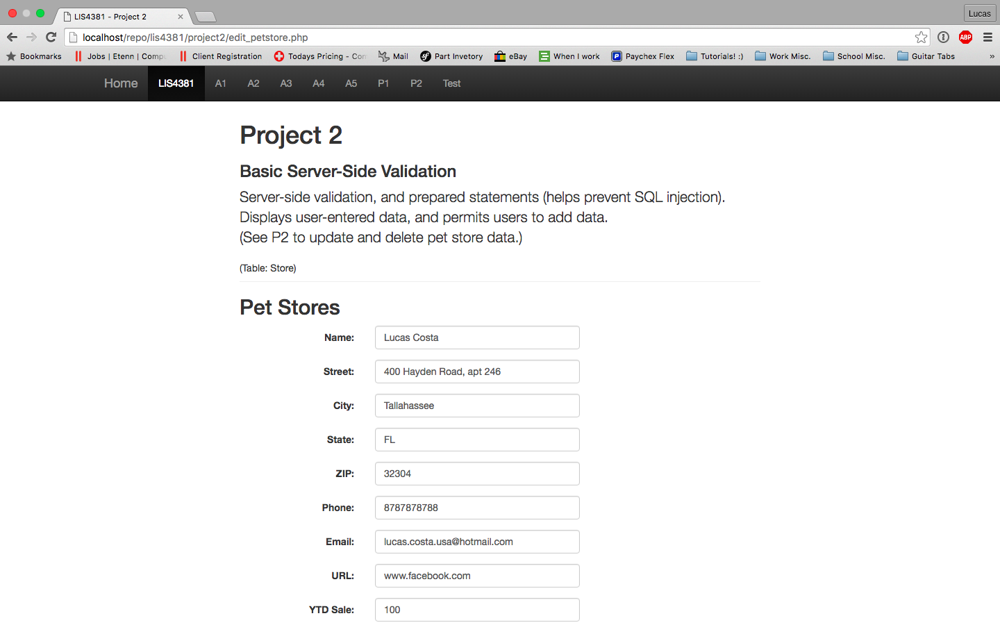
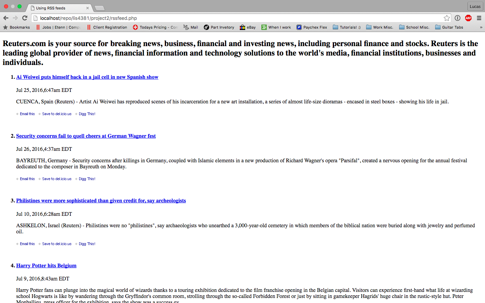

> **NOTE:** This README.md file should be placed at the **root of each of your repos directories.**
>
>Also, this file **must** use Markdown syntax, and provide project documentation as per below--otherwise, points **will** be deducted.
>

# LIS 4381 - Mobile Web Application Development

## Lucas Costa

### Project 2 Requirements:

1. Course Title, my name, assignment requirements as per A1
2. Screenshots;

#### README.md file should include the following items:

* Screenshot of index.php;
* Screenshot of edit_petstore.php;
* Screenshot of edit_petstore_process.php;
* Screenshot of Carousel;
* Screenshot of RSS feed;

> This is a blockquote.
>
> This is the second paragraph in the blockquote.

##### Assignment Screenshots:

* Screenshot of index.php;

* Screenshot of edit_petstore.php;

* Screenshot of Carousel;

* Screenshot of RSS feed;

