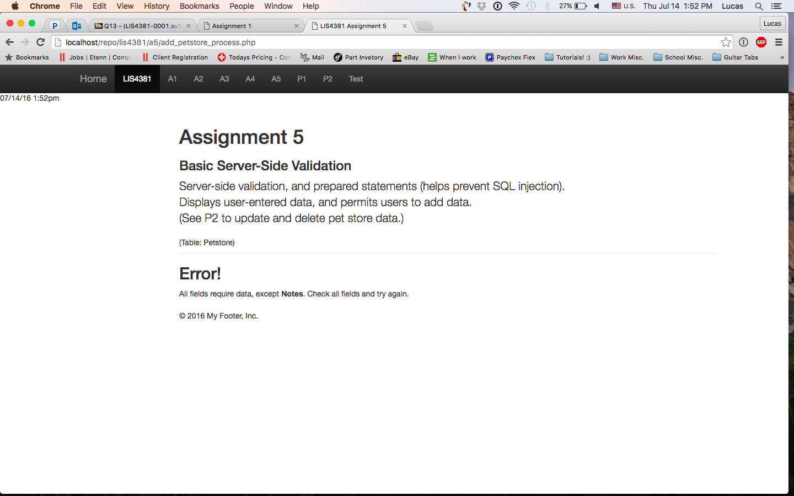

> **NOTE:** This README.md file should be placed at the **root of each of your repos directories.**
>
>Also, this file **must** use Markdown syntax, and provide project documentation as per below--otherwise, points **will** be deducted.
>

# LIS 4381 - Mobile Web Application Development

## Lucas Costa

### Assignment 5 Requirements:

1. Course Title, my name, assignment requirements as per A1
2. Screenshot;

#### README.md file should include the following items:

* Screenshot of a5 validation;
* Screenshot of failed validation;

> This is a blockquote.
>
> This is the second paragraph in the blockquote.

##### Assignment Screenshots:

* Screenshot of a5 validation;

* Screenshot of failed validation;

* Local host link
[Local Host link](http://localhost/repo/lis4381/a5/index.php)
