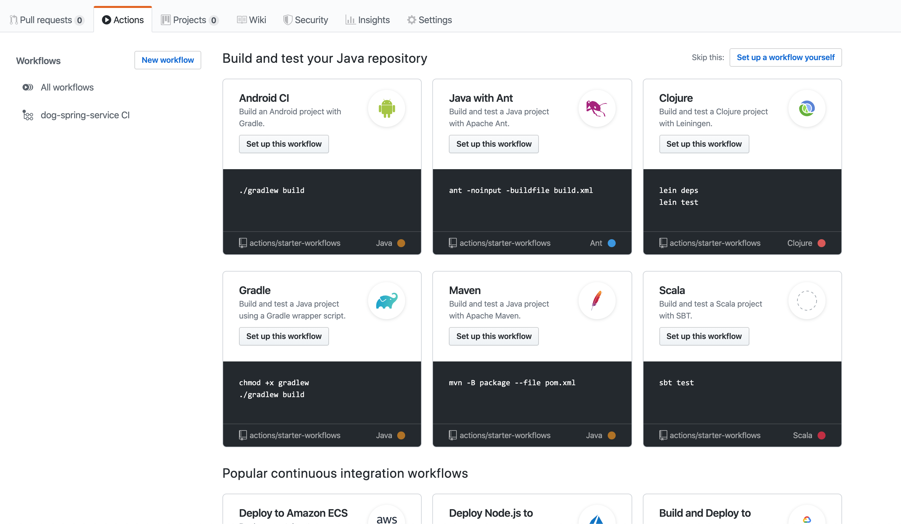
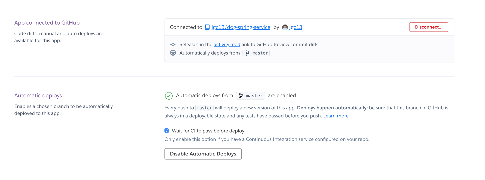

# CI-CD | Continuous Integration, Continuous Delivery)

## GitHub

- add a `Worflow`



Ex: `Gradle`

- this will create a `repoName/.github/workflows/gradle.yml` file with the following:

```yaml
name: Java CI  # change this name to w/e you want 

on: [push]

jobs:
  build: # job name used in the next step

    runs-on: ubuntu-latest

    steps:
    - uses: actions/checkout@v2
    - name: Set up JDK 1.8   # change name
      uses: actions/setup-java@v1
      with:
        java-version: 1.8   # change to your Java version
    - name: Grant execute permission for gradlew
      run: chmod +x gradlew
    - name: Build with Gradle
      run: ./gradlew build

```

- require this workflow to pass in order to merge to master:

1. Add a rule in `myRepo > Settings > Branches > Branch protection rules > Add rule`
2. Branch name pattern: `master`
3. Check the `Require status checks to pass before merging` box
4. In `Status checks found in the last week for this repository`, add the `job` name that you want
   - in this case: `build` 
   
## Heroku

You can have Heroku automatically deploy your app once merged to `master`:

1. Open Heroku website > your-app-name > `Deploy` tab
2. Connect it to your `GitHub` account
3. Under `App connected to GitHub`, you want to:
    - `Enable Automic Deploys`
    - Check `Wait for CI to pass before deploy`
    
Example:

